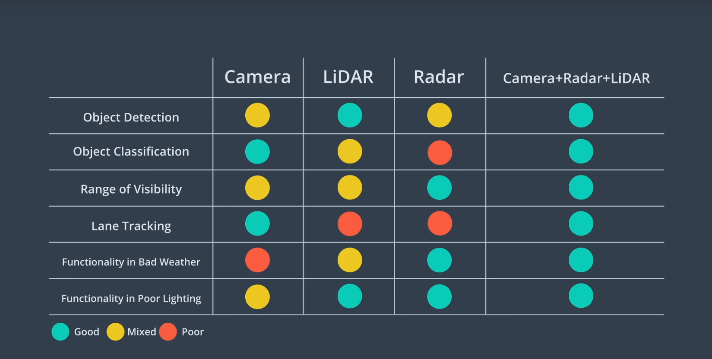

# Levels of automation

0. obvious

1. adaptive cruise control

2. Partial automation _(e.g. lane keeping)_

3. Conditional Automation _(e.g. lange change)_

4. High automation _(human intervention only in emergency)_

5. Full automation _(no intervention)_


blue lidar
orange - radar
yellow - camera
gray - ultrasonic

# Sensors

- Camera
    +
- LIDAR
- Ultrasonic (sound waves)
- Radar (radio waves)
    + the only one that measures speed directly (in one measurement instead of a differential reading between two timestamps)
    + can sense non-line of sight objects

# Perception and its tasks

## Detection & classification

Could be used to detect obstacles 
Detection answers a question - _where in the image is the thing_

First, you use a detection network to localize an object (e.g. traffic light) within an image. Then, you can use a classification network to classify the light (green, red, yellow, arrow, pedestrian, etc.).

Some of the algorithms used:
R-CNN, Fast R-CNN, Faster-RCNN, YOLO, SSD.

R-CNN full name is _Regions with Convolutional Neural Network Features_

## Tracking

Enhances perception, especially when detection fails
- handles occlusion (zasłonięcie)
- preserves identity (so an object in one frame is considered the same car in another)

## Semantic segmentation

Assigning each pixel in the image to a class.
Important for stuff like figuring out the drivable area.
Example:
- matching all pixels in the image to different classes:
    - tree pixel
    - building pixel
    - road pixel
    - other car

Algorithms: FCN (Fully Convolutional Network)

### FCN

A way to do semantic segmentation of the image. Because convolutional layers downsize the image, we need to upscale it (e.g. with upooling layers).

N x (Conv-maxpool) + N x (unpool)


More:
https://arxiv.org/pdf/1411.4038.pdf


## Sensor data for perception

This graphics 

source: udacity Self-Driving Car Fundamentals course

# Prediction
Prediction results in predicted trajectories (positions in timestamps) of other objects on the road.
```
trajectory = f(t) = position(t)
```

## Model based predictions
    - using laws of physics, traffic laws etc
    - work well with objects that have a well-defined predictable physical framework
        + Determining maximum safe turning speed on a wet road.
    - works well if there is a small ammount of discrete behaviors to model 

## Data Driven predictions
    - using ML (e.g. RNNs)
    - works well with objects that are new/unpredictible and difficult to model
        + Predicting the behavior of an unidentified object sitting on the road.

# Planning

- Routing (find the best A->B route)
    - Needs inputs:
        - position A
        - position B
        - map
            - preferably with real-time data
            - can be represented as a graph in which streets/places are nodes and decisions are edges
        
- Trajectory generation (low level).
    ```
    The task is to find a high precision trajectory (set of waypoints) to move around the route. The waypoints are defined in 3D space (2D + time).
    ```
    - have to take constraints into account
    - Deep reinforcement learning

# Control

- input:
    - trajectory
    - state of the vehicle
- outputs:
    - steering (steering wheel, left, right)
    - acceleration/decceleration (speed of wheels)

- constrains:
    - non-holonomous robot
    - comfort of passengers

## Control algorithms

- PID
- Linear Quadratic Regulator
- Model Predictive Control

