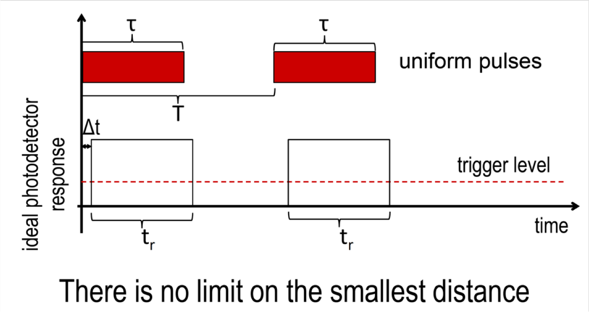
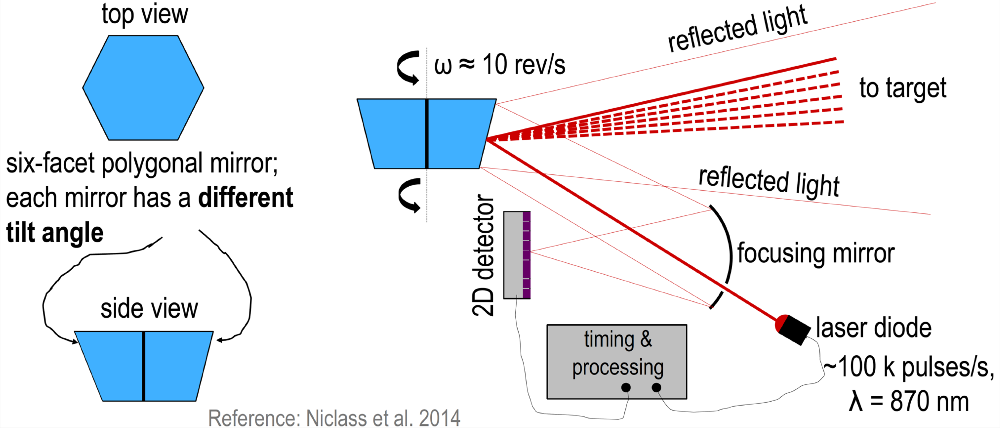
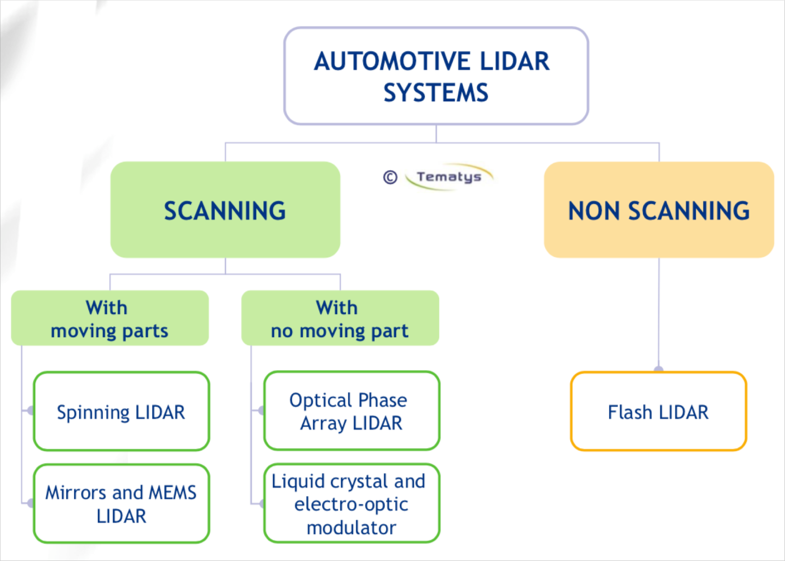
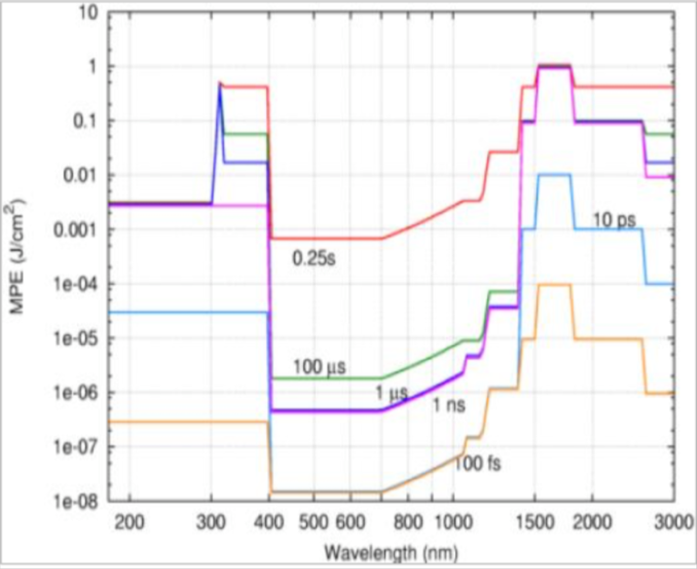

# LIDAR

- Stands for: ```L```ight ```D```etection ```A```nd ```R```anging
- Works on ToF princple

# Limitations:

## Light speed

- Light travels 15cm in 1ns. In other words - it takes it 6.7 ns to travel 1m.
- The non-zero length of time pulse causes distance measurement uncertainty equal to
```1/2c * t ``` (t- duration of the pulse).

## Beam Divergence & finite aperture size 

## Photon budget

Not all of the transmitted light comes back to the receiver due to phenomena like:

- atmospheric extinction  coefficient
- target reflectivity 
- finite aperture of the receiver

## Minimal distance

If pulses were perfect step functions there'd be no minimal distance.




# Mechanical implementation of vertical scanning



# Types of lidars


- Scanning:
    + spinning (mechanically moving mirror)
    + electrostatic MEMS mirrors
- Non-scanning
    + flashing [with APD (avalanche photodiode array)]


## Near IR vs Short-wave IR
- Currently NIR (905nm)
- In the future probably SWIR (1550nm)
    + higher power (even 100x)
    + Requires InGaAs detectors which are expansive
    + Requires InP sources (also expansive)

